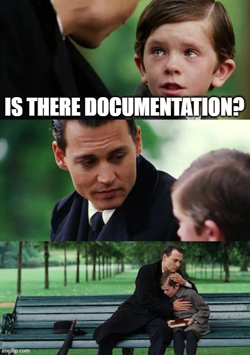

# PureBlog : Pure content. Any language.

A minimal static blog engine that converts Markdown posts to HTML with enhanced multilanguage support.

## Quick start

```sh
make build    # Build the site (creates venv automatically)
make serve    # Build and start a local server on port 8000
make test     # Run the unit tests
make lint     # Run flake8, mypy (strict), and bandit on src/
make e2e      # Build a Docker image and run Playwright end-to-end tests
make clean    # Remove the build directory and virtual environments
```

## Writing posts

Create a Markdown file in `posts/` named `{prefix}-{slug}.{lang}.md` where `{prefix}` is a numeric ID linking translations together, `{slug}` is the URL-friendly name, and `{lang}` is one of `en`, `fr`, or `nl`:

```markdown
---
title: My Post Title
date: 2026-02-16
excerpt: A short summary shown on the index page and used for SEO.
---

Your content here.
```

The `excerpt` field is optional. When provided, it appears below the post title on the index page and is used as the `<meta name="description">` tag on the post page. When no excerpt is set, the meta description falls back to the first 200 characters of the post body.

An estimated reading time is automatically calculated from the post word count (200 words per minute) and displayed alongside the date on both post and index pages, localized per language.

For example, `001-hello-world.en.md` produces the URL `/en/hello-world/`. To add a French translation with its own SEO-friendly slug, create `001-bonjour-le-monde.fr.md` (same prefix `001` links the translations). The French version will be served at `/fr/bonjour-le-monde/`.

The post body supports the standard Markdown syntax used by Pureblog: headers (`#` to `####`), `**bold**`, `_italic_` / `*italic*`, `~~strikethrough~~`, unordered (`-`) and ordered (`1.`) lists, blockquotes (`>`), inline `` `code` ``, triple-backtick fenced code blocks, and images (``). The full list with examples is in [`docs/markdown-cheatsheet.md`](docs/markdown-cheatsheet.md).

## Images and assets

Static assets (images, etc.) live in the directory configured by `general.assets_dir` (default: `assets/`). The whole directory is copied verbatim into `build/assets/` on every build, so internal images can be referenced from posts using their project-root relative path:

```markdown


```

Relative `` URLs are rewritten at build time to resolve from each page's location. If a referenced internal image cannot be found in `assets_dir`, the build prints a warning to stderr but still completes.

The site builds a per-language index at `/{lang}/` and a root page that redirects to `/en/`. A language switcher appears on every page, linking to the correct per-language slug for each translation.

If a translation is missing for a post, the build prints a warning to stderr (the build still succeeds), and the language switcher renders the missing language as a strikethrough link pointing to the current page so the reader does not get a 404.

## RSS feeds

Each language has an RSS 2.0 feed at `/{lang}/feed.xml` (e.g. `/en/feed.xml`). All HTML pages include an RSS autodiscovery `<link>` tag so feed readers can find the feed automatically.

The feed URLs use the `site_url` value in `config/config.yml` (currently `https://example.com`). Update it to your actual domain before deploying.

Run `make build` to generate the static site in `build/`.

## SEO: sitemap and robots.txt

The build generates `/sitemap.xml` listing every per-language index and post page (with `<lastmod>` taken from the post date or, for index pages, the most recent post in that language).

The static file `seo/robots.txt` is copied to `/robots.txt` at the root of the build output. The build appends `Sitemap: {site_url}/sitemap.xml` if that directive is not already present, so the source file only needs the rules you care about.

## Configuration

All blog settings live in `config/config.yml`. The file is split into four documented sections:

- `general`: site title, site URL, posts directory, build directory, assets directory.
- `seo`: path to the source `robots.txt` file.
- `languages`: list of language codes plus localized labels for reading time and the back link.
- `publish`: timezone and default publish hour used for RSS dates.
- `theme`: paths to the template and stylesheet files.

All fields are mandatory. The build aborts with an explanatory error if any field is missing or invalid (for example, a missing label for a declared language, or an unknown timezone).

To use a different configuration file, pass it via `--config`:

```sh
python3 src/main.py --config path/to/your-config.yml
```

## Project structure

```
src/
  main.py           CLI entrypoint (argument parsing, config loading)
  builder.py            BlogBuilder class and helper functions for site generation
  config.py             Configuration loader and validator
  markdown_parser.py    Markdown-to-HTML rendering used by the builder
  test_builder.py       Unit tests for the builder
  test_config.py        Unit tests for the configuration loader
  test_markdown_parser.py  Unit tests for the Markdown parser
docs/
  markdown-cheatsheet.md  Supported Markdown syntax reference
config/
  config.yml      Blog configuration (general, seo, languages, publish, theme)
seo/
  robots.txt      Static robots rules; build appends Sitemap directive
theme/
  template.html   HTML page template
  style.css       Stylesheet
posts/            Markdown source files
assets/           Static assets (images, etc.) copied verbatim into build/assets/
e2e/
  Dockerfile      Playwright image that builds + serves + tests the site
  run.sh          Container entrypoint: serve build/ then run pytest
  test_e2e.py     Playwright end-to-end tests
```

## End-to-end tests

`make e2e` builds a Docker image based on the official Playwright Python image
(`mcr.microsoft.com/playwright/python`), produces the static site inside the
container, serves it on port 8000 and runs the Playwright test suite in
`e2e/test_e2e.py` against it. The tests cover the root redirect, per-language
indexes, post pages, language switching (including the missing-translation
self-link), the back link, RSS feeds, the sitemap and `robots.txt`.

This target requires a working Docker daemon. Unit tests (`make test`) do not
depend on Docker and remain the fast feedback loop for development.
